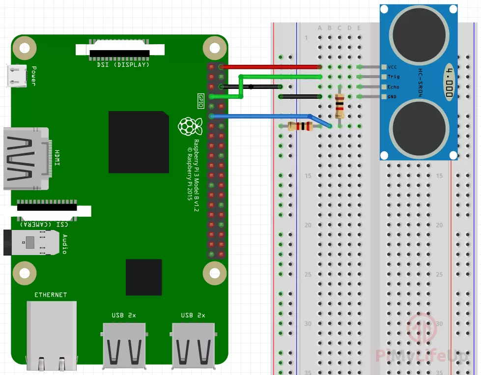

Raspi Robot
===========

.. image:: https://img.shields.io/badge/license-GPL-blue.svg
    :target: https://github.com/veryplay/raspi-robot
    :alt: License

.. image:: https://img.shields.io/badge/build-passing-green.svg
    :target: https://github.com/veryplay/raspi-robot
    :alt: Build Status

.. image:: https://img.shields.io/badge/python-2.7%20%7C%203.6-blue.svg
	:target:  https://github.com/veryplay/raspi-robot
	:alt: Python Versions

Raspi Robot is a simple python program for raspberry 3B, include Motor Shield(L298N), Ultrasonic Sensor(HC-SR04) component.

Connection Detail of Motor Shield(L298N)
----------------------------------------

.. image:: ./docs/L298N.png

Connection Detail of Ultrasonic Sensor(HC-SR04)
-----------------------------------------------

Usage
-----

.. code:: bash

    python raspi_robot/robot.py

Note
----

Need to change L298N/HC-SR04's actual GPIO port in `driver.py`、`decelerator.py`、`ultrasonic.py`.